# Session Guide: Building Escape Room Experiences in Business Central

**Conference:** Directions for Partners  
**Session title:** Building Escape Room Experiences in Business Central  
**Duration:** 45 minutes + optional bonus (~10 min if time allows)  
**Format:** Code walkthrough in VS Code + BC demo (code is pre-written; we walk through it, not type it live)  
**Audience:** BC developers (partner conference attendees)  
**Goal:** Walk through all 12 AL objects of the "Escape Directions" venue, explaining every architectural decision, demonstrate all three validation patterns live in BC, and — if time allows — show a real production escape room (OptimAL) and how AI-assisted design was used to build it

---

## Timeline Overview

| # | Segment | Duration | Cumulative | Mode |
|---|---|---|---|---|
| 1 | Intro — What Is This? | ~3 min | 0:00 – 0:03 | Slides → BC |
| 2 | Architecture — Framework Design | ~4 min | 0:03 – 0:07 | Slides → VS Code |
| 3 | The Wiring: Enums + Install | ~4 min | 0:07 – 0:11 | Slide → VS Code |
| 4 | The Hierarchy: Venue + Rooms + HTML | ~4 min | 0:11 – 0:15 | Slide → VS Code |
| 5 | Pattern 1 — Polling | ~6 min | 0:15 – 0:21 | Slide → BC → VS Code |
| 6 | Pattern 2 — Event Subscriber | ~8 min | 0:21 – 0:29 | Slide → BC → VS Code |
| 7 | Pattern 3 — Test Codeunit | ~9 min | 0:29 – 0:38 | Slide → BC → VS Code |
| 8 | Wrap-Up — What You Can Build | ~7 min | 0:38 – 0:45 | Slides |
| ★ | BONUS — OptimAL: A Real Escape Room + AI Design | ~14 min | 0:45 – 0:59 | Slides → BC → VS Code |

---

## Segment 1 — Intro: What Is This?

**Duration:** ~3 min | **Cumulative:** 0:00 – 0:03  
**Mode:** Slides → BC  
**Pre-condition:** `waldo_EscapeDirections_1.0.0.0.app` is already installed in BC

---

### Slides

#### Slide 1 — Title

> **Building Escape Room Experiences in Business Central**
>
> Waldo — Directions for Partners 2026

---

#### Slide 2 — What Is It?

**Heading:** What's an Escape Room in Business Central?

**Content:**
- A gamified, task-validated learning experience running *inside* BC
- Participants open rooms, read a challenge, and complete BC tasks to unlock the next room
- Three types of task validation: **Polling**, **Event Subscriber**, **Test Codeunit**
- Built on the **BCTalent.EscapeRoom** framework (open source, waldo & AJ)

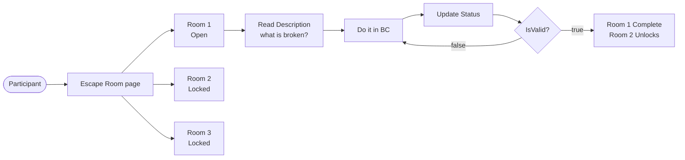

---

#### Slide 3 — What We're Building Today

**Heading:** Escape Directions — 3 Rooms, 1 Task Each

| Room | Theme | Validation Pattern |
|---|---|---|
| Room 1: Find Your Badge | Fix company information | Polling |
| Room 2: Network or Perish | Create a contact | Event Subscriber |
| Room 3: Exit Interview | Automated verification | Test Codeunit |

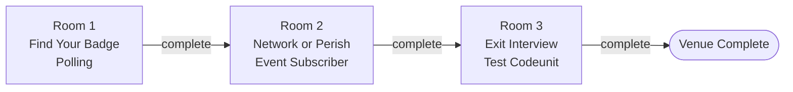

**Say:** *"This is what we're walking through today — for each topic: slide, BC demo, then code. Let's start by seeing what a participant actually experiences."*

> **Transition:** Switch to BC.

---

### Demo — Show the Finished Result

**Setup:** BC is open, `Escape Directions` venue is installed and ready to play.  
**Goal:** Walk through all 3 rooms as a participant so the audience sees what they're building.

> **Important:** Reset the venue state before the session starts if it was already played through. Company Name should NOT be "Directions 2026" and no "Directions Partner" contact should exist.

#### Step 1.1 — Open the venue

1. In BC, open the search bar (`Alt+Q` or the magnifying glass)
2. Search for **Escape Room**
3. Open the **Escape Room** page
4. Point out: the **Escape Directions** venue, its description, and the list of rooms

**Say:** *"This is what a participant sees when they open the framework. One venue, three rooms — Room 1 is open, Rooms 2 and 3 are locked."*

#### Step 1.2 — Open Room 1 and show the Description

1. Click on **Room 1: Find Your Badge** to open it
2. Show the room page — point out: the room description, the task list, the task status (Not Started), the **Update Status** button, the **Solve** button
3. Click the **Description** action (or it may show inline) to open the HTML description
4. Read the TL;DR aloud: *"Your conference badge has the wrong company name. Fix it."*
5. Close the description

**Say:** *"The description is mystery-first — it tells them WHAT is broken, not HOW to fix it. The solution is behind the Solve button, shown to facilitators or after the room completes."*

#### Step 1.3 — Show the venue overview

1. Navigate back to the main **Escape Room** page
2. Point out: Room 2 and Room 3 show padlock icons — locked until Room 1 completes
3. Point out the timer — participants track their own elapsed time

**Say:** *"Same framework for every venue. Three rooms here — one per pattern. We'll demonstrate each one when we get to that code."*

---

### Transition to Segment 2

**Say:** *"Now let's look at the architecture — then for each pattern: slide, BC demo, code."*

Switch to VS Code.

---

---

## Segment 2 — Architecture: How the Framework Fits Together

**Duration:** ~4 min | **Cumulative:** 0:03 – 0:07  
**Mode:** Slides → VS Code

---

### Slide 4 — The Three-Level Hierarchy

**Heading:** Framework Architecture

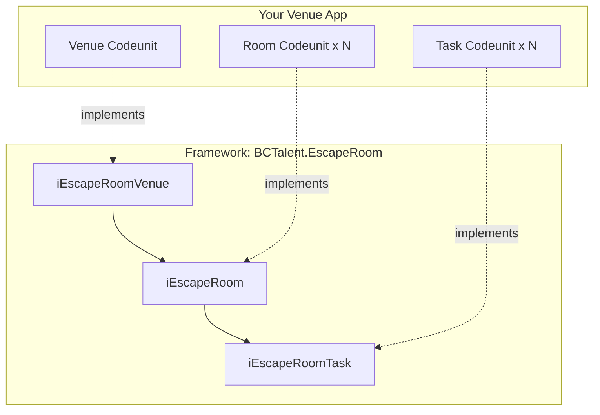

- Everything is driven by **three AL interfaces** — one per level
- The framework holds the engine: tables, pages, status management, cascades
- You provide codeunits that implement the interfaces
- The framework never references your codeunits directly — it resolves them through AL's `Implementation` keyword on enum values

**Say:** *"The framework doesn't know your code exists. You register via an enum value — with an `Implementation` clause that points the framework to your codeunit. No factory pattern, no switch statement, no coupling. Pure AL interface dispatch."*

---

### Slide 5 — The 12 Objects You Write

**Heading:** What You Actually Build

| # | Object | Type | Purpose |
|---|---|---|---|
| 1 | `EscapeRoomVenueExt` | EnumExt | Registers venue with `Implementation` |
| 2 | `EscapeRoomExt` | EnumExt | Registers 3 rooms with `Implementation` |
| 3 | `EscapeRoomTaskExt` | EnumExt | Registers 3 tasks with `Implementation` |
| 4 | `EscapeDirections Venue` | Codeunit | Implements `iEscapeRoomVenue` |
| 5–7 | `Room1/2/3 ED` | Codeunit ×3 | Implement `iEscapeRoom` |
| 8 | `R1T1 Complete Registration ED` | Codeunit | Polling validation |
| 9 | `R2T1 Make A Connection ED` | Codeunit | Event subscriber validation |
| 10 | `R3T1 Prove You Were Here ED` | Codeunit | Test codeunit orchestration |
| 11 | `Exit Interview Test ED` | Codeunit (Test) | The actual test assertions |
| 12 | `Install EscapeDirections` | Codeunit (Install) | One-liner registration |

Plus 6 HTML resource files (Description + Solution per room).

**Say:** *"Twelve AL objects. That's the whole app. The framework provides all UI, status cascade, room unlocking, telemetry. You own the logic."*

---

### VS Code — Show the File Tree

Open the `Src/` folder in the Explorer pane. Point out the structure:

```
Src/
├── EscapeRoomVenueExt.EnumExt.al
├── EscapeRoomExt.EnumExt.al
├── EscapeRoomTaskExt.EnumExt.al
├── EscapeDirectionsVenue.Codeunit.al
├── InstallEscapeDirections.Codeunit.al
└── Rooms/
    ├── Room1FindYourBadge/
    │   ├── Room1FindYourBadge.Codeunit.al
    │   └── Tasks/
    │       └── R1T1CompleteRegistration.Codeunit.al
    ├── Room2NetworkOrPerish/ ...
    └── Room3ExitInterview/ ...
```

**Say:** *"Three enum extensions flat at the top. Venue codeunit. Install codeunit. Then each room has its own folder with its room codeunit and a `Tasks/` subfolder. Convention, not enforced — but it makes the hierarchy visible in the file tree."*

---

---

## Segment 3 — The Wiring: Enums + Install Codeunit

**Duration:** ~4 min | **Cumulative:** 0:07 – 0:11  
**Mode:** Slide → VS Code

---

### Slide — The `Implementation` Keyword: How AL Wires Your Code to the Framework

**Heading:** Three Enum Extensions — Zero Coupling

```
Escape Room Venue   →   extend, add one value for your venue
Escape Room         →   extend, add one value per room
Escape Room Task    →   extend, add one value per task

Each value gets: Implementation = iEscapeRoomXxx = "YourCodeunit"
```

- The framework casts an enum value to an interface at runtime — AL dispatches to your codeunit transparently
- **The framework compiles without knowing your codeunit exists** — true zero coupling
- No dispatcher, no case statement, no factory pattern — the enum value IS the factory

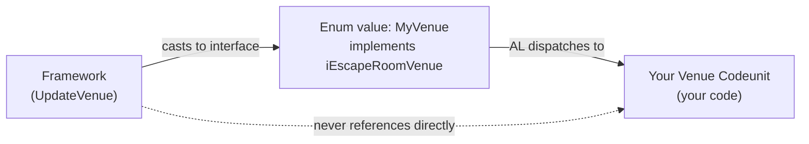

**Say:** *"This is one of the most underused features in AL. Extend the enum, add the `Implementation` clause, and the framework calls your code. That's the entire registration mechanism."*

---

### Open `EscapeRoomVenueExt.EnumExt.al`

```al
enumextension 74300 "EscapeDirections Venue" extends "Escape Room Venue"
{
    value(74300; EscapeDirections)
    {
        Caption = 'Escape Directions';
        Implementation = iEscapeRoomVenue = "EscapeDirections Venue";
    }
}
```

**Point out:**
- This extends the **framework's enum** — the framework's tables use `Enum "Escape Room Venue"` as a primary key field
- The `Implementation` keyword is the **entire wiring mechanism** — it says: "when the framework asks this enum value for its `iEscapeRoomVenue` implementation, hand it `"EscapeDirections Venue"`"
- The framework does: `Enum::"Escape Room Venue"::EscapeDirections` auto-casts to `Interface iEscapeRoomVenue` and calls methods on your codeunit
- Zero coupling. The framework compiles without knowing this codeunit exists.

---

### Open `EscapeRoomExt.EnumExt.al`

```al
enumextension 74301 "EscapeDirections Rooms" extends "Escape Room"
{
    value(74301; FindYourBadgeED)
    {
        Caption = 'Find Your Badge';
        Implementation = iEscapeRoom = "Room1 Find Your Badge ED";
    }
    value(74302; NetworkOrPerishED) { ... }
    value(74303; ExitInterviewED) { ... }
}
```

**Point out:**
- Suffix `ED` (EscapeDirections) on enum values — essential for avoiding collision with other venues that extend the same enum
- Same `Implementation` pattern, one level down — now pointing to `iEscapeRoom` implementations

---

### Open `EscapeRoomTaskExt.EnumExt.al`

Same pattern for tasks. One enum extension covers all tasks in the venue — there is no per-room task enum.

**Say:** *"Three files. Three enums. That's the registration desk. The framework walks the hierarchy by calling `GetRooms()`, iterating, calling `GetTasks()` on each. No config files, no registration tables you manage manually."*

---

### Open `InstallEscapeDirections.Codeunit.al`

```al
codeunit 74311 "Install EscapeDirections"
{
    Subtype = Install;

    trigger OnInstallAppPerCompany()
    var
        EscapeRoom: Codeunit "Escape Room";
    begin
        EscapeRoom.UpdateVenue(Enum::"Escape Room Venue"::EscapeDirections);
    end;
}
```

**Point out:**
- One line. The enum value auto-casts to `iEscapeRoomVenue`.
- `UpdateVenue()` cascades automatically: calls `GetVenueRec()` → upsert venue record, iterates `GetRooms()` → upsert each room, iterates `GetTasks()` → upsert each task.
- **Idempotent** — existing records are skipped, not duplicated. Safe to call on upgrade — add `OnUpgradePerCompany` with the same call.

**Say:** *"One line on install. The enum value IS the handle. The framework walks the entire hierarchy from there."*

---

---

## Segment 4 — The Hierarchy: Venue + Rooms + HTML

**Duration:** ~4 min | **Cumulative:** 0:11 – 0:15  
**Mode:** Slide → VS Code

---

### Slide — Interface: `iEscapeRoomVenue`

**Heading:** Your Venue Codeunit Must Implement 5 Methods

| Method | Returns | What it provides |
|---|---|---|
| `GetVenueRec()` | `Record "Escape Room Venue"` | Id, Name, Description, App ID, Publisher |
| `GetVenue()` | `Enum "Escape Room Venue"` | Which enum value this venue is |
| `GetRooms()` | `List of [Interface iEscapeRoom]` | Your ordered room list — order = unlock sequence |
| `GetRoomCompletedImage()` | `InStream` | Badge shown when a room completes (optional) |
| `GetVenueCompletedImage()` | `InStream` | Badge shown when the venue completes (optional) |

- `GetVenueRec()` is called on install to seed the database record
- `GetRooms()` is how the framework discovers your rooms — order defines the unlock sequence
- Image methods: return an empty `InStream` and the framework skips them gracefully

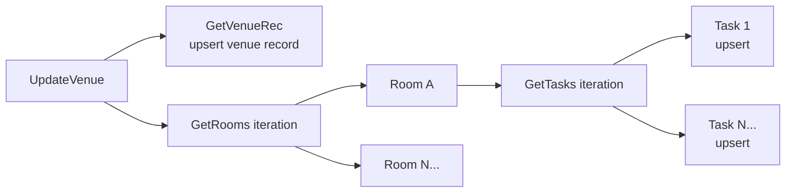

**Say:** *"Five methods. Two do the real work: `GetVenueRec()` returns the data that goes in the table, and `GetRooms()` is how the framework discovers your room hierarchy."*

---

### Open `EscapeDirectionsVenue.Codeunit.al`

```al
codeunit 74303 "EscapeDirections Venue" implements iEscapeRoomVenue
{
    procedure GetVenueRec() EscapeRoomVenue: Record "Escape Room Venue"
    var
        Me: ModuleInfo;
    begin
        NavApp.GetCurrentModuleInfo(Me);
        EscapeRoomVenue.Id := Me.Name;
        EscapeRoomVenue.Name := Me.Name;
        EscapeRoomVenue.Description := 'Escape the Directions conference ...';
        EscapeRoomVenue.Venue := Enum::"Escape Room Venue"::EscapeDirections;
        EscapeRoomVenue."App ID" := Me.Id;
        EscapeRoomVenue.Publisher := Me.Publisher;
    end;
```

**Point out:**
- `NavApp.GetCurrentModuleInfo(Me)` — reads app name, ID, publisher dynamically at runtime. No hardcoding. The same codeunit works in any environment regardless of publisher or version.
- Method returns a **populated record variable**, not a saved DB record. Framework calls `UpdateVenue()`, which calls `GetVenueRec()`, compares with what's in the table, then upserts.

```al
    procedure GetRooms() Rooms: List of [Interface iEscapeRoom]
    begin
        Rooms.Add(Enum::"Escape Room"::FindYourBadgeED);
        Rooms.Add(Enum::"Escape Room"::NetworkOrPerishED);
        Rooms.Add(Enum::"Escape Room"::ExitInterviewED);
    end;
```

**Point out:**
- Adding **enum values** to a `List of [Interface iEscapeRoom]` — AL auto-casts because the enum `implements iEscapeRoom`
- **Order is sequence** — Room 1 unlocks first, Room 2 unlocks when Room 1 is done, etc.
- Image methods return empty `InStream` — no images in this venue, framework handles gracefully

---

### Slide — Interface: `iEscapeRoom`

**Heading:** Each Room Codeunit Implements 6 Methods

| Method | Returns | What it provides |
|---|---|---|
| `GetRoomRec()` | `Record "Escape Room"` | VenueId, Name, Description, Sequence |
| `GetRoom()` | `Enum "Escape Room"` | Which enum value this room is |
| `GetTasks()` | `List of [Interface iEscapeRoomTask]` | Your ordered task list |
| `GetRoomDescription()` | `Text` | HTML shown in the room description panel |
| `GetRoomSolution()` | `Text` | HTML shown when participant clicks Solve |
| `GetHintImage()` | `InStream` | Optional hint image |

- `Name` in `GetRoomRec()` **must equal** `Format(GetRoom())` exactly — it's the primary key in the framework tables
- `Sequence` drives the unlock order — Room 1 first, Room 2 when Room 1 completes, etc.
- Description and Solution are HTML strings — load from `Resources/` via `NavApp.GetResourceAsText()`

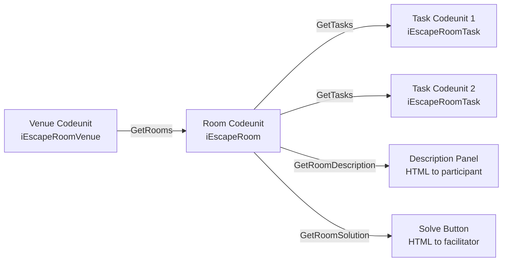

**Say:** *"Six methods, same contract for every room. Key detail: use `Format(this.GetRoom())` for the Name — never hardcode the string. It's the primary key."*

---

### Open `Rooms/Room1FindYourBadge/Room1FindYourBadge.Codeunit.al`

```al
codeunit 74304 "Room1 Find Your Badge ED" implements iEscapeRoom
{
    procedure GetRoomRec() EscapeRoom: Record "Escape Room"
    var
        Me: ModuleInfo;
    begin
        NavApp.GetCurrentModuleInfo(Me);
        EscapeRoom."Venue Id" := Me.Name;
        EscapeRoom.Name := Format(this.GetRoom());
        EscapeRoom.Description := 'Complete your conference registration...';
        EscapeRoom.Sequence := 1;
    end;
```

**Point out:**
- `EscapeRoom.Name := Format(this.GetRoom())` — formats the enum value to its string name. This becomes the room's primary key in the framework tables. Using `Format()` guarantees it matches exactly, no hardcoded literal string that could drift.
- `this` keyword (BC 24+) — self-reference through the interface. Calls `GetRoom()` on the same codeunit. Cleaner than a local variable workaround.
- `Sequence` determines the unlock order.

```al
    procedure GetRoomDescription() RoomDescription: Text
    begin
        RoomDescription := NavApp.GetResourceAsText('Room1FindYourBadgeDescription.html');
    end;

    procedure Solve()
    var
        RichTextBoxPage: Page "Rich Text Box Page";
    begin
        RichTextBoxPage.Initialize('Solution', NavApp.GetResourceAsText('Room1FindYourBadgeSolution.html'));
        RichTextBoxPage.RunModal();
    end;
```

**Point out:**
- `NavApp.GetResourceAsText()` — loads the HTML file from the `Resources/` folder at runtime. File names must be declared in `app.json` under `"resourceFolders"`. Change the HTML, republish — updated content, no table schema changes.
- `Solve()` uses the framework's built-in `Rich Text Box Page` — pass caption + HTML string, run modal. Done. No custom page needed.
- Rooms 2 and 3 are structurally identical — show the file tree, explain all three room codeunits follow the exact same 5-method contract.

**Say:** *"The venue codeunit is the lobby. Room codeunits are the doors. Both just return data — the framework is the engine that drives everything else."*

---

### Show `Room1FindYourBadgeDescription.html` and `Room1FindYourBadgeSolution.html`

Open Description in VS Code:
- Pure HTML — no JavaScript, no external CSS, inline styles only (BC HTML viewer constraint)
- 6 sections: H1, TL;DR, The Challenge, Your Mission, Update Status reminder, What's Next
- **Mysterious** — WHAT is broken, not HOW to fix it. No method names, no solution code.

Open Solution briefly. The contrast:
- Step-by-step instructions, complete code blocks, "Why This Matters" explanations
- The split is intentional — curiosity drives learning more than instruction does

Loaded at runtime via `NavApp.GetResourceAsText()` — update the HTML, republish, new content. No schema changes.

---

---

## Segment 5 — Pattern 1: Polling

**Duration:** ~6 min | **Cumulative:** 0:15 – 0:21  
**Mode:** Slide → BC → VS Code

---

### Slide — Interface: `iEscapeRoomTask` + Pattern 1: Polling

**Heading:** The Task Interface — One Method Does the Work

| Method | Returns | What it provides |
|---|---|---|
| `GetTaskRec()` | `Record "Escape Room Task"` | VenueId, RoomName, Name, Description |
| `GetTask()` | `Enum "Escape Room Task"` | Which enum value this task is |
| `IsValid()` | `Boolean` | Called on Update Status — `true` completes the task |
| `GetHint()` | `Text` | Plain-text hint shown to participants |

**Pattern 1 — Polling:**
- `IsValid()` reads database state at the moment Update Status is clicked
- Returns `true` → task completes → room cascade → next room unlocks
- No state, no subscribers — completely stateless

**Use when:** A field check, object existence, config value — anything readable from DB state right now.

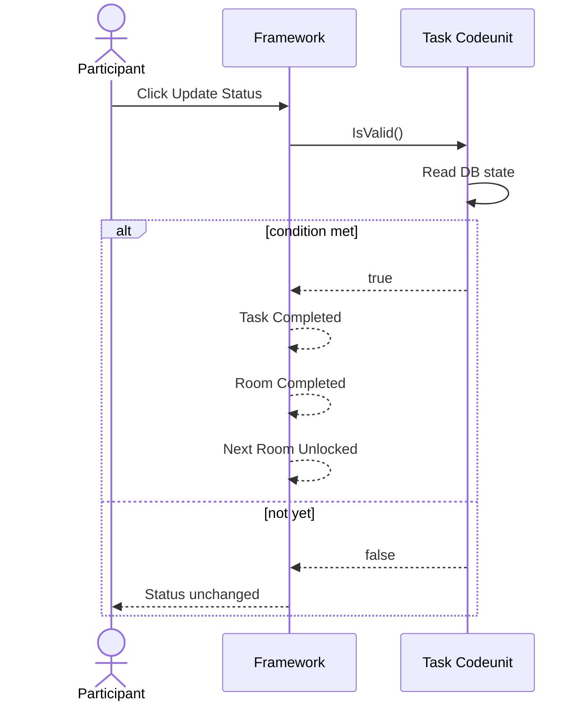

**Say:** *"Three methods are metadata. One method — `IsValid()` — is your entire logic. Return true and the task completes."*

---

### BC Demo — Room 1: Polling in Action

> Switch to BC → Escape Room page → Room 1 (Find Your Badge)

1. Show Room 1 task listed as **In Progress**, Update Status visible
2. Click **Update Status** → task stays In Progress (Company Name isn't right yet)
3. Search **Company Information** → change Name to `Directions 2026`
4. Return to Room 1 → click **Update Status**

**Observe:** Task → Completed. Room 1 closes. Room 2 unlocks.

**Say:** *"`IsValid()` was called. It read `CompanyInformation.Name`. It matched. Cascade fired."*

> Switch to VS Code

---

### VS Code — `R1T1CompleteRegistration.Codeunit.al`

```al
codeunit 74307 "R1T1 Complete Registration ED" implements iEscapeRoomTask
{
    var
        Room: Codeunit "Room1 Find Your Badge ED";

    procedure GetTaskRec() EscapeRoomTask: Record "Escape Room Task"
    var
        Me: ModuleInfo;
    begin
        NavApp.GetCurrentModuleInfo(Me);
        EscapeRoomTask."Venue Id" := Me.Name;
        EscapeRoomTask."Room Name" := Format(Room.GetRoom());
        EscapeRoomTask.Name := Format(this.GetTask());
        EscapeRoomTask.Description := 'Fix your company name on the conference badge.';
    end;
```

**Point out:**
- `var Room: Codeunit "Room1 Find Your Badge ED"` — instantiated to call `Room.GetRoom()` and get the room's string name. No hardcoded string — the codeunit IS the source of truth.
- `Format(this.GetTask())` — same self-referencing pattern for the task name.

```al
    procedure IsValid(): Boolean
    var
        CompanyInformation: Record "Company Information";
    begin
        if not CompanyInformation.Get() then
            exit(false);
        exit(CompanyInformation.Name = 'Directions 2026');
    end;
```

**Point out:**
- This is the **entire validation** — one record read, one field comparison, return bool.
- No state. No `SingleInstance`. Completely stateless.
- The framework calls `IsValid()` when the user clicks **Update Status**. `true` → task completed → cascade.

**When to use polling:**
> Field checks, object/extension existence checks, configuration values, anything detectable by reading the current database state.

---

---

## Segment 6 — Pattern 2: Event Subscriber

**Duration:** ~8 min | **Cumulative:** 0:21 – 0:29  
**Mode:** Slide → BC → VS Code

---

### Slide — Pattern 2: Event Subscriber

**Heading:** Don't Wait for the Button — Subscribe to the Moment

- `IsValid()` returns **`false` always** — Update Status cannot complete this task
- An event subscriber detects the right action and calls `SetStatusCompleted()` directly
- Completion is **instant** — at the exact moment the participant does the thing
- **Requires `SingleInstance = true`** — without it, a fresh codeunit per event fire loses all state

**Use when:** Real-time detection of record inserts or modifies.

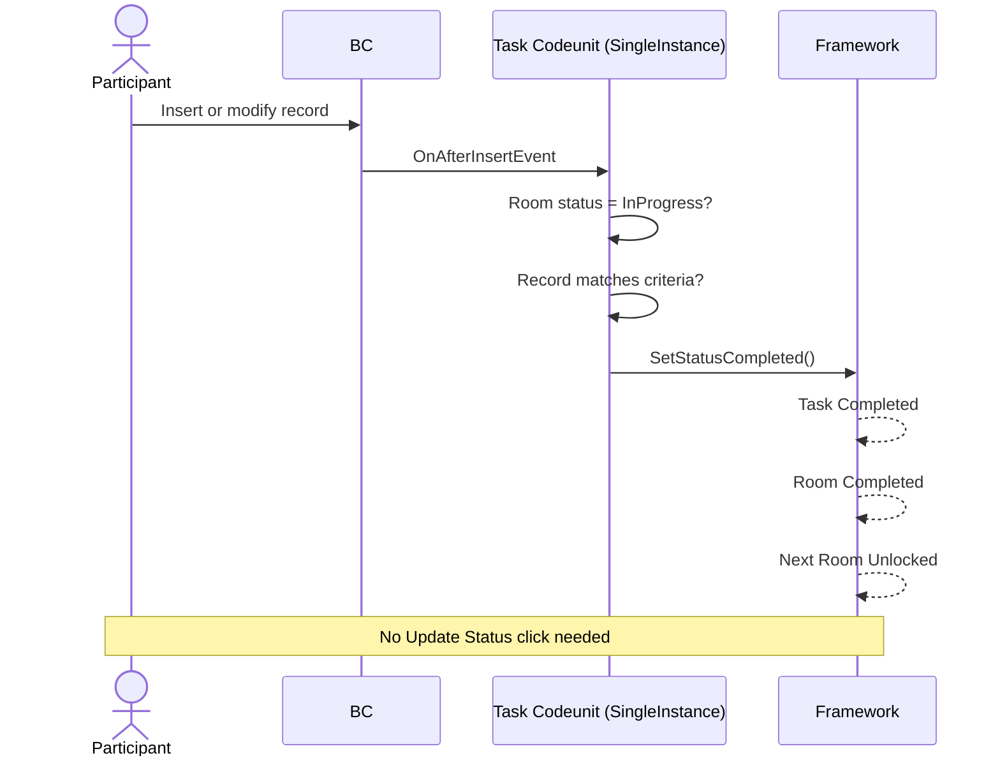

**Say:** *"The framework still calls IsValid() on Update Status — gets false. The only path is the subscriber. The participant does the thing, the event fires, done."*

---

### BC Demo — Room 2: Event Subscriber in Action

> Switch to BC → Escape Room page → Room 2 (Network or Perish) — should now be unlocked

1. Show Room 2 task **In Progress**
2. Search **Contacts** → New → set Company Name to `Directions Partner` → navigate away / save

**Observe:** Room 2 completes **instantly** — no button click. Room 3 unlocks.

**Say:** *"`OnAfterInsertEvent` fired. Room status was InProgress. Company Name matched. `SetStatusCompleted()` called. Done before you switched tabs."*

> Switch to VS Code

---

### VS Code — `R2T1MakeAConnection.Codeunit.al`

```al
codeunit 74308 "R2T1 Make A Connection ED" implements iEscapeRoomTask
{
    SingleInstance = true;

    var
        Room: Codeunit "Room2 Network Or Perish ED";
```

**Point out — `SingleInstance = true`:**
- Without `SingleInstance`, BC instantiates a **fresh codeunit** for every event fire. The `Room` variable would be uninitialized; any state would be lost between calls.
- With `SingleInstance`, exactly one instance exists per session. State persists, room guard works correctly.
- **This is mandatory for any task codeunit that uses event subscribers.**

```al
    procedure IsValid(): Boolean
    begin
        exit(false);
    end;
```

**Point out:** `IsValid()` returns `false` hard. This task cannot complete via Update Status — the only path to completion is through the event subscriber.

```al
    [EventSubscriber(ObjectType::Table, Database::Contact, OnAfterInsertEvent, '', false, false)]
    local procedure ContactOnAfterInsert(var Rec: Record Contact)
    begin
        if Room.GetRoomRec().GetStatus() <> Enum::"Escape Room Status"::InProgress then
            exit;

        if Rec."Company Name" <> 'Directions Partner' then
            exit;

        this.GetTaskRec().SetStatusCompleted();
    end;
```

**Point out — the room status guard:**
- `GetStatus() <> InProgress` — exits immediately if Room 2 isn't actively open. Without this, every Contact inserted anywhere in BC during any other session would run through this code.
- This is the single most important safeguard pattern in event subscriber tasks.

**Point out — both Insert AND Modify:**
- `OnAfterInsertEvent` covers: user creates Contact with Company Name set → fires.
- `OnAfterModifyEvent` (in Room2 file) covers: user creates Contact first, then edits Company Name → fires.
- Both are subscribed because participants do it both ways.

**Point out — `SetStatusCompleted()`:**
- This one call: marks the task done → fires a notification → checks the room's `No. of Uncompleted Tasks` FlowField → if 0, closes the room → opens the next room. The cascade is a single call.

**When to use event subscribers:**
> Real-time detection of record inserts or modifies — when you want instant completion without a button click.

---

---

## Segment 7 — Pattern 3: Test Codeunit

**Duration:** ~9 min | **Cumulative:** 0:29 – 0:38  
**Mode:** Slide → BC → VS Code

---

### Slide — Pattern 3: Test Codeunit

**Heading:** Rich Assertions, Specific Error Messages, Multi-Step Validation

- `IsValid()` runs a standard `Subtype = Test` codeunit and returns the `Success` result
- Use `Error()` in the test — the message goes directly to the participant as actionable feedback, not "task failed"
- Can validate anything an AL test can: read records, invoke pages, check FlowFields, assert complex state
- **Technical requirement:** `Commit()` before running the test; `SelectLatestVersion()` after — the test commits its own transaction

**Use when:** Multi-table or multi-step validation, or anywhere you need to tell participants exactly what's wrong.

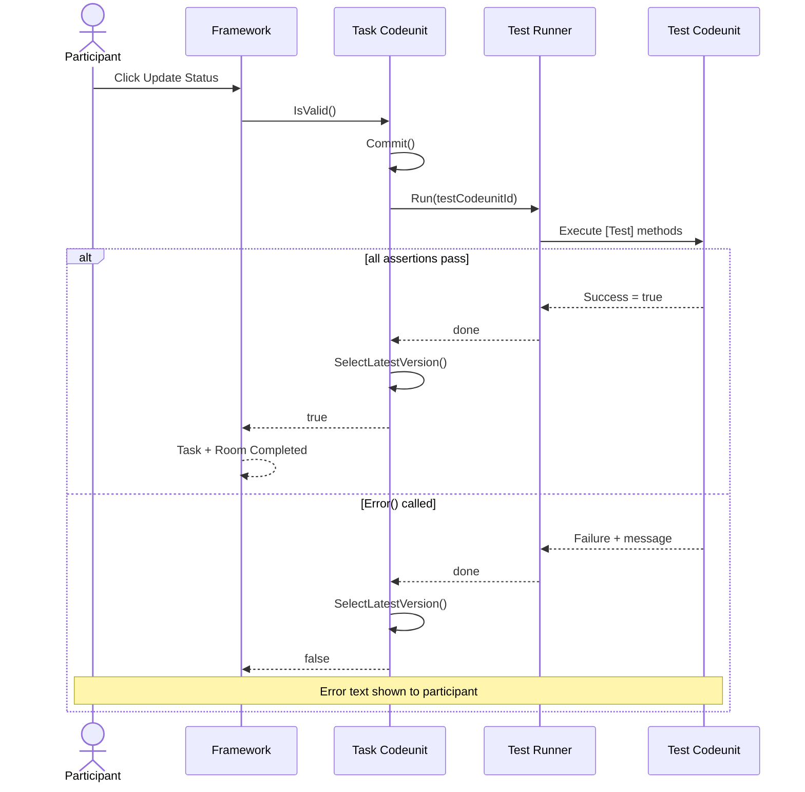

**Say:** *"Room 3 validates that both Room 1 AND Room 2 were done — it's the final checkpoint. And if it fails, it tells you exactly which room to go back to."*

---

### BC Demo — Room 3: Test Codeunit in Action

> Switch to BC → Escape Room page → Room 3 (Exit Interview) — should now be unlocked

1. Click **Update Status**

**Observe:** Both assertions pass. Room 3 completes. Venue complete.

**Demonstrate a failure:**
1. Change Company Name to something other than `Directions 2026`
2. Reset Room 3 to In Progress (or use a pre-reset environment)
3. Click **Update Status**

**Observe:** Error: *"Your badge still shows the wrong company name. Go back to Room 1."*

**Say:** *"That's the `Error()` call from the test codeunit. Specific instruction — not 'validation failed'."*

> Switch to VS Code

---

### VS Code — `R3T1ProveYouWereHere.Codeunit.al` + `ExitInterviewTestED.Codeunit.al`

This is split across two files. Open both side by side.

**File 1 — The task codeunit (`IsValid()`):**

```al
    procedure IsValid(): Boolean
    var
        TestQueue: Record "Test Queue";
        TaskValidationTestRunner: Codeunit "Task Validation Test Runner";
        TestCodeunitId: Integer;
    begin
        TestCodeunitId := Codeunit::"Exit Interview Test ED";

        if TestQueue.Get(TestCodeunitId) then
            TestQueue.Delete();

        TestQueue.Init();
        TestQueue."Codeunit Id" := TestCodeunitId;
        TestQueue.Success := false;
        TestQueue.Insert();

        Commit();
        TaskValidationTestRunner.Run(TestQueue);

        SelectLatestVersion();
        TestQueue.Get(TestCodeunitId);

        exit(TestQueue.Success);
    end;
```

**Walk through each step:**
1. Delete any stale `TestQueue` record — clean state before each run
2. Insert fresh record with `Success = false`
3. **`Commit()`** — mandatory. Tests run in their own transaction; without committing first, the test runner can't see the record we just inserted.
4. `TaskValidationTestRunner.Run()` — framework runner that executes the test codeunit and captures pass/fail
5. **`SelectLatestVersion()`** — mandatory after the test. The runner committed its own transaction. Without this, the NST cache serves stale data — still shows `Success = false`.
6. Re-read the record and return `Success`

**Say:** *"The `Commit()` + `SelectLatestVersion()` pair is the technical gotcha in this pattern. You'll hit the caching bug once in development and never forget it again."*

**File 2 — The test codeunit (`ExitInterviewTestED.Codeunit.al`):**

```al
codeunit 74310 "Exit Interview Test ED"
{
    Subtype = Test;
    TestPermissions = Disabled;

    [Test]
    procedure VerifyConferenceAttendance()
    var
        CompanyInformation: Record "Company Information";
        Contact: Record Contact;
    begin
        // Verify Room 1 result
        CompanyInformation.Get();
        if CompanyInformation.Name <> 'Directions 2026' then
            Error('Your badge still shows the wrong company name. Go back to Room 1.');

        // Verify Room 2 result
        Contact.SetRange("Company Name", 'Directions Partner');
        if Contact.IsEmpty() then
            Error('No networking contact found. Go back to Room 2.');
    end;
}
```

**Point out:**
- Standard `Subtype = Test` codeunit with `TestPermissions = Disabled`
- Uses `Error()` — the error message goes directly to the participant as actionable feedback. Not "task failed" — a specific instruction.
- Validates **both rooms** in one test — Room 3 serves as the final checkpoint for the entire venue
- Could do anything an AL test can: invoke pages, test actions, insert/validate records, check flowfields

**When to use test codeunits:**
> Multi-step, multi-table, or complex assertions — anywhere you need rich error messages, or where validation logic is too complex for a simple bool return.

---

---

## Segment 8 — Wrap-Up: What You Can Build

**Duration:** ~7 min | **Cumulative:** 0:38 – 0:45  
**Mode:** Slides

---

### Slide 9 — The Three Validation Patterns

| Pattern | `IsValid()` | Completes when | `SingleInstance` | Best for |
|---|---|---|---|---|
| **Polling** | Returns true/false | User clicks Update Status | No | Field checks, config, object existence |
| **Event Subscriber** | Returns `false` | Event fires → `SetStatusCompleted()` | **Yes** | Real-time insert/modify detection |
| **Test Codeunit** | Orchestrates test run | User clicks Update Status | No | Multi-step, multi-table, complex assertions |

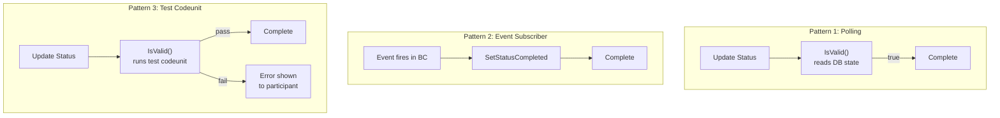

---

### Slide 10 — What You Can Build

**Heading:** Any Domain. Any Audience.

- **Developer training** — AL patterns, performance optimization, architecture challenges (→ OptimAL)
- **Consultant onboarding** — BC setup tasks, configuration walks, functional challenges (→ Consultant.1)
- **Partner enablement** — certification prep, cloud migration checklists, feature discovery
- **Conference sessions** — exactly what we just did

**The full stack:** Framework (open source) → Venue apps → Any BC environment  
**Participants need nothing installed** — just BC with the framework + your venue app

---

### Slide 11 — Get Started

- **Framework:** GitHub — `waldo & AJ / BCTalent.EscapeRoom`
- **Spec for AI:** `copilot-instructions.md` in the repo — complete prompt specification for building venues with an AI agent
- **This app's source:** `waldo / waldo.BCEscapeRooms.Demo`

**Say:** *"The copilot-instructions.md is essentially a complete system prompt. Load it + the framework source into context, write a design doc, and an AI agent will generate a working venue. We'll show that in the bonus segment."*

---

---

## ★ BONUS — OptimAL: A Real Escape Room + AI-Assisted Design

**Duration:** ~14 min | **Cumulative:** 0:45 – 0:59  
**Mode:** Slides → BC → VS Code  
**Condition:** Only run if Segment 8 ends at or before 0:44

---

### Why This Bonus Exists

EscapeDirections is a teaching toy — 3 rooms, 1 task each, trivial validation. **OptimAL** is what a production escape room actually looks like:

- 7 rooms, each with 2–3 tasks
- A companion PTE (problem extension) that participants download, fix, and republish — they write AL themselves
- A central performance measurement framework: custom tables, SQL statement counting, timing
- Validation compares before vs. after: improvement required in both duration AND SQL count
- **Built entirely with AI assistance from a written design specification — the same workflow as EscapeDirections**

---

### Slide — What a Production Venue Looks Like

**Heading:** OptimAL — 7 Rooms, A Two-Extension Architecture, Real Performance Work

Show overview:
- The story arc: "OptimAL Corporation's digital transformation" — participants experience the problems in Room 1, then fix them one by one
- Room progression: Experience → DataTransfer → Profiler → SetLoadFields → SIFT Keys → Locking → N+1
- The twist: participants download the source of OptimAL.PTE, change the code, and republish. The escape room measures them invisibly from outside.

**Say:** *"Same three interfaces you've seen all session. But now IsValid() doesn't check a field — it checks whether your optimized AL code reduced SQL from 50,000 to under 30."*

---

### Part A — BC Demo: Playing OptimAL (~4 min)

> Switch to BC — open the Escape Room page, select the OptimAL venue

**Step A.1 — Show the venue and room list**
- Venue: OptimAL Corporation Performance Venue
- 7 rooms listed, Room 1 unlocked, Rooms 2–7 locked behind it
- Point out: locked rooms show the padlock, same framework as EscapeDirections

**Step A.2 — Open Room 1: Experience the Problems**
- Show the Description HTML — the mystery framing: "something is wrong, experience it yourself"
- Show the task list: multiple tasks visible, each with a status
- Point out: participants get the problem code, they run it, they feel the slowness — this is the "before"

**Step A.3 — Open a completed room (pick one deeper in the chain, e.g. Room 4 or 7)**
- Show a task that's been completed: green checkmark
- Scroll to the Performance Measurements page (or navigate there directly)

> Search for `Performance Measurements` in BC

- Show a measurement record: Code = `R7-N+1`, Duration, SQL Statements Executed
- **This is the proof artifact.** The escape room created this record by subscribing to an event in the PTE. Participants never touch this table directly.

**Say:** *"The participant ran their optimized code. The PTE fired an integration event. EscapeRoom1 caught it, measured it, wrote this record. Then IsValid() ran, saw SQL < 30, task completed. Zero coupling — the participant never sees this happening."*

**Step A.4 — Show what fails gracefully**
- Navigate to a room that's still locked
- Show the Update Status button doing nothing (prerequisite room not done)
- **Say:** *"The framework enforces the sequence. No skipping."*

---

### Part B — VS Code: The Two-Extension Architecture (~3 min)

#### Open `OptimAL.EscapeRoom1/Src/` alongside `OptimAL.PTE/Src/`

**Show the dependency direction:**

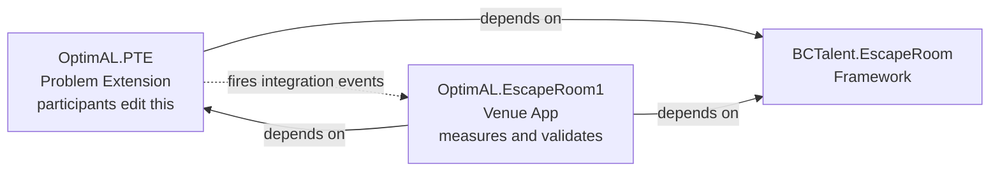

- `OptimAL.PTE` contains the slow/broken code — it knows **nothing** about escape rooms
- It exposes integration events at key moments. That's all.
- `OptimAL.EscapeRoom1` subscribes to those events, captures timing and SQL counts, writes the Perf Measurement record

Point out the companion app's `launch.json`:
```json
"dependencyPublishingOption": "Ignore"
```
**Say:** *"Without this, VS Code throws confusing errors when participants hit F5. One line prevents that."*

#### Open `TaskEliminateN1.Codeunit.al` (Room 7)

```al
procedure IsValid(): Boolean
var
    PerfMgr: Codeunit "Performance Measurement Mgr";
    Measurement: Record "Performance Measurement";
begin
    if not PerfMgr.GetLastMeasurement('R7-N+1', Measurement) then
        exit(false);

    exit(Measurement."SQL Statements Executed" < 30);
end;

[EventSubscriber(ObjectType::Table, Database::"Performance Measurement",
    OnAfterInsertEvent, '', true, true)]
procedure HandlePerformanceMeasurementInsert(var Rec: Record "Performance Measurement")
begin
    if Rec."Measurement Code" <> 'R7-N+1' then exit;
    if IsValid() then TaskComplete();
end;
```

**Point out:**
- `'R7-N+1'` is the **contract string** between PTE (writes this code) and EscapeRoom1 (reads it). A typo = task can never complete. Convention: `R[room]-[SHORT-DESCRIPTION]`.
- `SQL Statements Executed < 30` — the original N+1 generates 50,001 queries (1 per customer + 1 for the list). The fix generates 1. Threshold of 30 is unambiguous.
- Same event subscriber pattern as Room 2 in EscapeDirections — but the event fires on the `Performance Measurement` table, not on `Contact`. The participant's better code triggers the measurement, which inserts the record, which fires this subscriber.

**Say:** *"Same framework. Same three patterns. Only the validation logic changes."*

---

### Part C — AI-Assisted Design: How Both Were Built (~4 min)

#### The Workflow

**Show on slide:**

```
1.  Framework docs + copilot-instructions.md   →  AI context (the quality gate)
2.  Design document (plain language)           →  you write: every room, task, validation
3.  Technical review (AI pass)                 →  interface compliance, ID conflicts, BC version issues
4.  Code generation (AI agent)                 →  all AL objects, HTML files, resource declarations
5.  Human review + test                        →  verify, run, iterate
```

**The most critical step is step 2. You own it.**

#### Open `OptimAL.EscapeRoom1/Instructions/InitialEscapeRoomDesign.md`

Show the structure: 7 rooms, each with business context, the observable challenge, the fix, the exact validation criteria. 
This is a 6,000+ line plain-language spec. **This was the AI input.**

Scroll through a room or two — point out: the design doc specifies exactly what `IsValid()` must check. Not "make it faster" — *"SQL Statements Executed < 30"*. That precision came from a human. No AI could have written it without domain knowledge.

**Open `OptimAL.EscapeRoom1/Src/` alongside**  
Point out: everything in `Src/` — all AL objects, all HTML — was generated from that document plus the framework docs. Human spec, AI boilerplate, human review on top.

#### Open `waldo.BCEscapeRooms.Demo/Design/EscapeDirections.design.md`

**Same workflow.** This demo app — what you've seen all session — was built with that process.

Show the design doc briefly. Then open `EscapeDirections.technical-review.md`:
- AI found a BC version issue
- AI flagged a naming conflict  
- Both fixed before a single line of AL was written

**Say:** *"The copilot-instructions.md is the quality gate — it defines every convention: folder structure, interface methods, validation patterns, HTML rules, the checklist. You give that plus the design doc to an AI agent, and it generates a compliant venue app. You write the spec. You review the output. The AI writes the boilerplate."*

**Critical point:** The hardest part is step 2. Writing precisely what validation check proves a task is done requires domain knowledge no AI has. It requires you.

---

### Part E — Telemetry + Leaderboard (~2 min)

#### Slide — Built-In Scoring via Azure Application Insights

**Heading:** Every Action Is Scored — Zero Configuration in Your Venue Code

```mermaid
flowchart LR
    subgraph FW [\" Framework fires automatically \"]
        TS[Task Completed] -->|+3| AI[Application Insights]
        RC[Room Completed] -->|+5 bonus| AI
        VC[Venue Completed] -->|+10 bonus| AI
        HR[Hint Requested] -->|-1| AI
        SR[Solution Viewed] -->|-3| AI
    end
    AI --> LB[Leaderboard\\nKQL query]
```

**Scoring at a glance:**

| Action | Points | Event name |
|---|---|---|
| Complete a task | **+3** | `EscapeRoomTaskFinished` |
| Complete a room | **+5** bonus | `EscapeRoomCompleted` |
| Complete the venue | **+10** bonus | `EscapeRoomVenueCompleted` |
| Request a hint | **−1** | `EscapeRoomHintRequested` |
| View solution | **−3** | `EscapeRoomSolutionRequested` |

**Key points:**
- Every event includes `PartnerName`, `FullName`, `VenueName`, `RoomName`, timing fields — all in `customDimensions`
- You write **zero telemetry code** in your venue app — it fires automatically from the framework tables
- The scoring model incentivises solving without hints: a perfect EscapeDirections run (3 tasks + 3 rooms + 1 venue) = **34 points**

**Say:** *"Point your BC environment at an Application Insights resource, and every participant action streams there in real time. Query it with KQL and you have a live leaderboard — who's ahead, who peeked at the solution, who's been stuck on Room 2 for half an hour."*

---

### Part D — Key Takeaways (~1 min)

#### Slide — Key Takeaways

**Heading:** Why It's Worth Your Time

- **Learning sticks when it's a game.** Participants remember what they figured out themselves far longer than what they were told. An escape room creates the tension, the "aha", and the story to tell colleagues on Monday.
- **It forces you to define "done".** Building task validation is a discipline: you cannot be vague. That clarity — knowing exactly what correct looks like — improves everything you build, escape room or not.
- **Training that feels like play scales better.** A well-designed venue runs the same for 5 people or 500. Participants self-pace. Facilitators aren't bottlenecks. The framework tracks progress for you.
- **The investment is small; the reuse is large.** A venue you build once runs at every onboarding, every partner day, every team training session. The second time costs almost nothing.
- **It's open source and open-ended.** Developer tracks, consultant tracks, customer onboarding, certification prep — same framework, different content. Whatever your audience needs to *do*, you can validate it.

**Say:** *"The technology is the easy part. The hard part is deciding what matters enough to turn into a challenge. That thinking is worthwhile on its own — and then you get a game out of it."*

---

## Appendix: Pre-Session Checklist

### BC Environment
- [ ] BC environment accessible and logged in
- [ ] `waldo_EscapeDirections_1.0.0.0.app` installed
- [ ] Company Name is **not** "Directions 2026" (reset before session)
- [ ] No Contact with Company Name "Directions Partner" exists (reset before session)
- [ ] Know how to quickly rename Company Name back for the Step 7.5 failure demo
- [ ] (BONUS) OptimAL venue installed in BC with at least one room completed so the `Performance Measurements` page has a real record to show
- [ ] (BONUS) Know which completed room has a `Performance Measurement` record — navigate there quickly during the demo

### VS Code
- [ ] `waldo.BCEscapeRooms.Demo` workspace open, file tree clean and readable
- [ ] `OptimAL.EscapeRoom1` workspace loaded (for bonus) — `TaskEliminateN1.Codeunit.al` and `Instructions/InitialEscapeRoomDesign.md` ready to navigate to quickly
- [ ] `waldo.BCEscapeRooms.Demo/Design/EscapeDirections.design.md` and `EscapeDirections.technical-review.md` bookmarked or open (for AI workflow demo)
- [ ] Font size increased for screen share / projector (16pt+)

### Slides
- [ ] Slide deck open on secondary display or ready to switch to
- [ ] Bonus slides prepared (Segment ★): overview slide + AI workflow diagram

### Timing anchors
- [ ] **0:03** → switch to VS Code, file tree (Segment 2)
- [ ] **0:07** → open enum files (Segment 3) — include the Implementation slide
- [ ] **0:11** → Segment 4 — interface slides then codeunits
- [ ] **0:15** → Slide: iEscapeRoomTask → BC demo (Room 1) → VS Code (Pattern 1) — do not rush
- [ ] **0:21** → back to slide for Pattern 2 → BC demo (Room 2) → VS Code
- [ ] **0:29** → slide for Pattern 3 → BC demo (Room 3 + failure) → VS Code
- [ ] **0:38** → back to slides, wrap-up (Segment 8)
- [ ] **0:45** → bonus only if on schedule — run Parts A (BC), B (VS Code), C (AI workflow) in order; each can be trimmed independently if time is short
